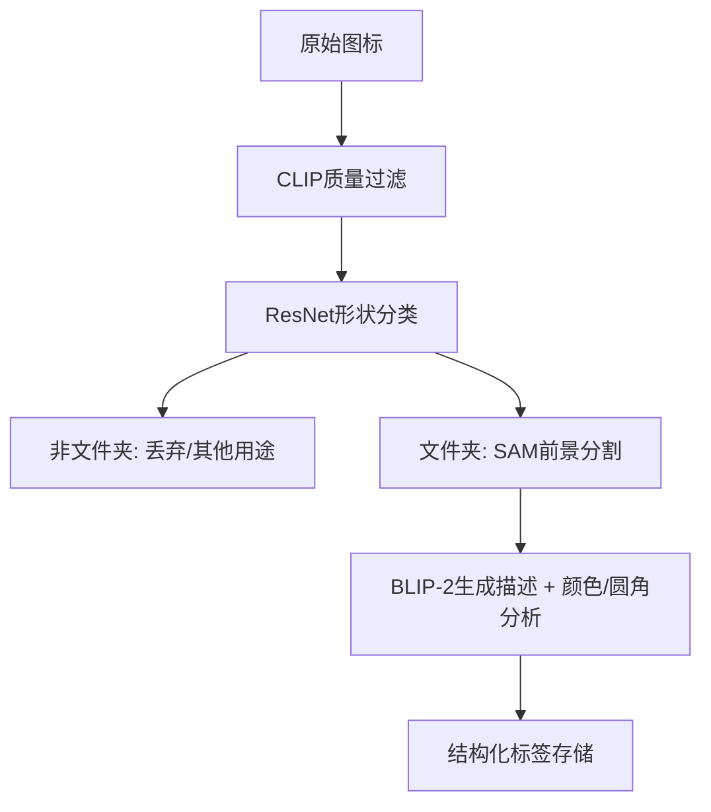

# 图标分类与标注自动化方案





## 核心模型推荐

|任务|首选模型|备选方案|训练数据需求|
|---|---|---|---|
|质量筛选|CLIP|EfficientNet|无需|
|形状分类|ResNet50|YOLOv8|100+样本|
|前景分割|SAM|DINOv2|无需|
|标签生成|BLIP-2|传统CV|无需|


### 1. 质量筛选阶段
- **推荐模型**：
  - `EfficientNet-B4`（ImageNet预训练微调）
  - `CLIP (ViT-B/32)`（零样本质量评估）
- **关键能力**：
  - 识别模糊/低信息量图标
  - 通过文本提示（如"high-quality icon"）计算相似度

### 2. 形状分类阶段
- **推荐模型**：
  - `ResNet50`（二分类微调）
  - `YOLOv8`（文件夹结构特征检测）
- **输出**：
  - 是/否文件夹形状
  - 检测开口、折角等特征

### 3. 前景物体检测
- **推荐方案**：
  - `Segment Anything Model (SAM)`（零样本分割）
  - `DINOv2`（自监督特征聚类）
- **优势**：
  - 自动分离背景与前景图案
  - 无需标注即可发现常见元素

### 4. 多标签标注
- **核心工具**：
  - `BLIP-2`（自然语言描述生成）
  - OpenCV（颜色直方图+圆角检测）
- **输出格式**：
  ```json
  {
    "object": "music note",
    "color": "blue",
    "shape": "rounded corners"
  }
